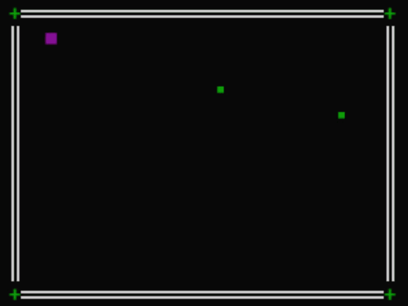

# Welcome to SnakyPy 🐍

**SnakyPy** is an Improvised terminal's Snake Game made in Python, including its own main menu with settings and more. 
Checkout how to install it and try your best playing!


--- 

<p align="center">
    
</p>

---

## Game Installation

### Requirements

- Python 3.10 or higher (menu.py uses match cases)
- [`pynput`](https://pypi.org/project/pynput/) library (included in `requirements.txt`)


###  Notes ⚠️

- **Windows users:** If your terminal doesn't support ANSI escape codes, install `colorama` and initialize it in `main.py`:  
  ```bash
  pip install colorama
- If you're running a Linux system, make sure to have an X-server started to detect the Keyboard (feature done automatically when you start GUI session)

## 💻 How to Run

### 1. Install dependencies indicated in requirements.txt with:

    pip install -r requirements.txt

Or manually:

    
    pip install pynput

### 2. Execute main.py file to initialize the game:

    python main.py


### ▶️ Skip the menu
If you wanna bypass the menu feature and just play, go to /objects and execute snake_game.py file with:

    python snake_game.py

   
Maybe i could do a .bat or .sh run executable to do this automatically

## DEFAULT CONTROLS 🎮 

    W: up
    A: left
    S: down
    D: right

    Q: Quit game (kill snake)

Enjoy it! 

---
